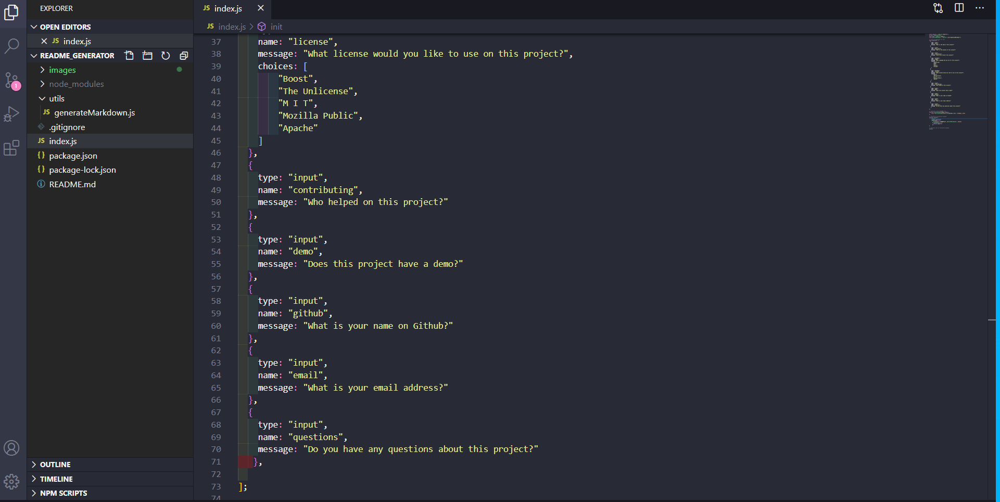
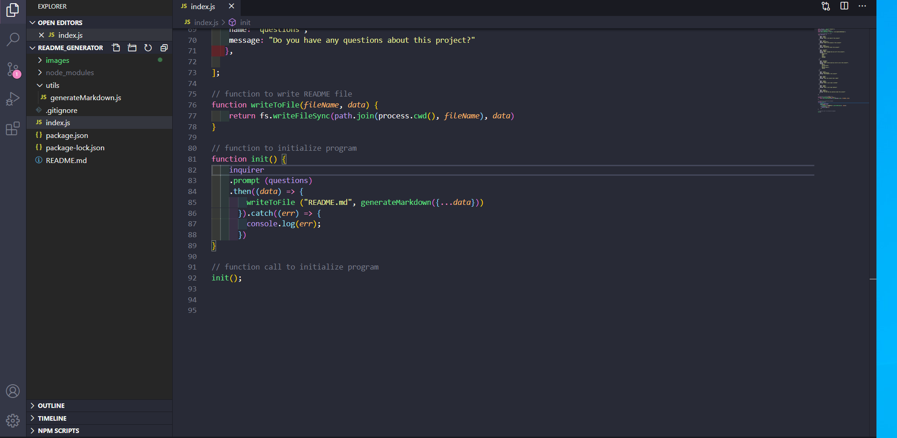
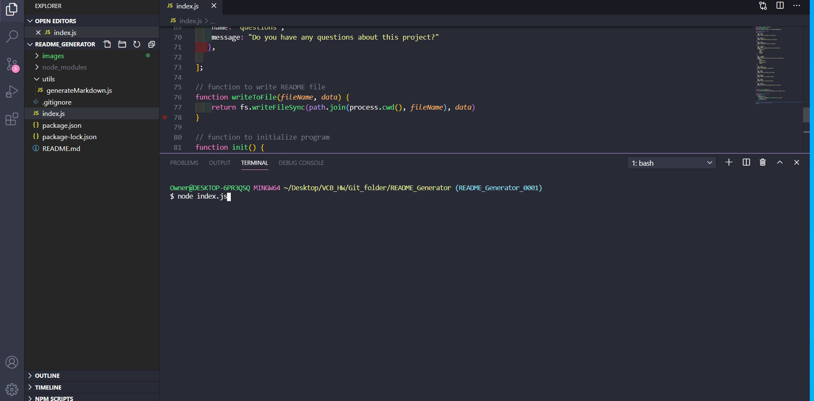
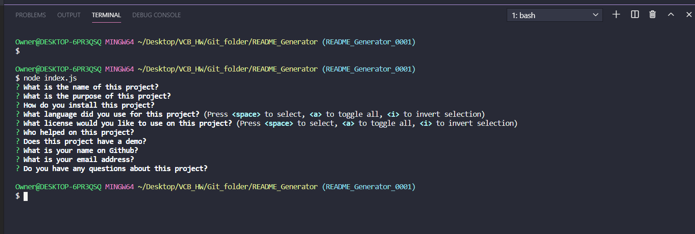
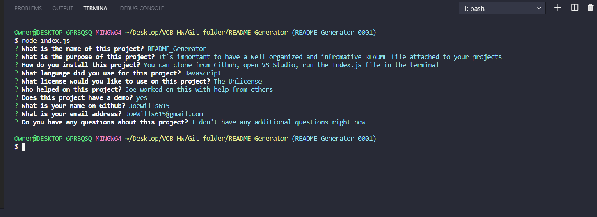

# README_Generator

# Table of Contents
* [Description](#description)
* [Installation](#installation)
* [Usage](#usage)
* [License](#license)
* [Contributing](#contributing)
* [Demo](#demo)
* [Questions](#questions)
* [Github_Info](#github_info)
* [Email_Address](#email_address)
* [Project_Images](#project_images)

# Desciption
  It's important to have a well organized and informative README file attached to your projects

# Installation
  You can clone it from Github, open VS Studio, and run the Index.JS file in the terminal

# Usage
  Javascript

# License
  The Unlicense

# Contributing
  Joe worked on this with help from others

# Demo
  Yes, the link for the demo is below

# Demo_Link
  [README_Generator Demo](https://drive.google.com/file/d/1L0TKOWWN13dmA5Cysw9s4uufbqDITs5E/view)

# Questions
  Not at this time

# Github_Info
  JoeWills615

# Email_Address
  JoeWills615@gmail.com

# Project_Images

  

   
   

  
  
   
   

  

   
   

  

   
   

  

    
   

  

 

